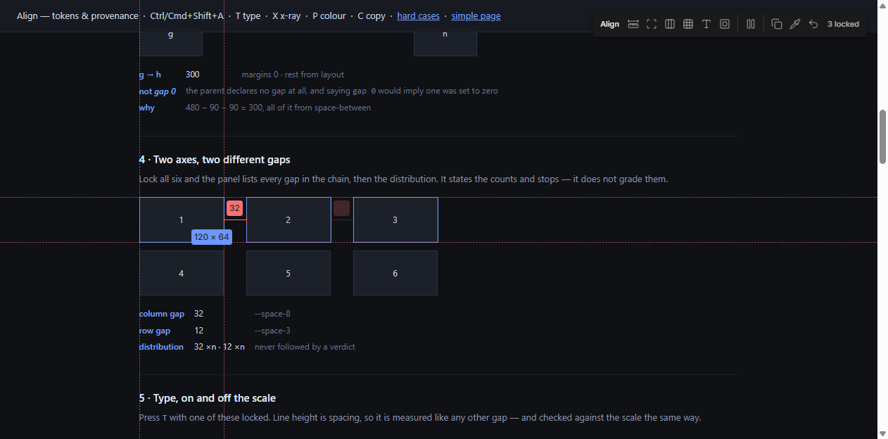

# align-ui

A dev-only measuring tool that runs inside your own project. Hover any element
to see its size, click to lock it, then hover another to get the exact distance
between them — fractions included.

It measures. It doesn't judge: whether `25.5px` is wrong is your call.



- One line to install, one line to wire up
- No runtime dependencies
- ~24 KB minified, 8.7 KB gzipped
- Physically absent from production builds
- Vite, Next.js, CRA, Remix, Astro, SvelteKit

---

## Install

```bash
npm i -D github:ViShEsHK2412/align-ui
```

Nothing is built on install. `dist/` is committed to the repo deliberately, so
the package works even where npm blocks lifecycle scripts — which recent npm
does by default. Then pick the line that matches your setup.

### Vite, Astro, SvelteKit, Remix, Nuxt

One line in the config, and nothing in application code:

```ts
// vite.config.ts
import align from 'align-ui/vite';

export default defineConfig({
  plugins: [align()],
});
```

The plugin is `apply: 'serve'`, so it does not exist during a production build —
there is no dev guard to remember and no way for the tool to reach a bundle by
accident. Options go straight in: `align({ hotkey: 'mod+shift+a' })`.

### Anything else

```ts
// entry file
if (import.meta.env.DEV) import('align-ui/auto');
```

Or take the handle yourself if you want to pass options:

```ts
if (import.meta.env.DEV) {
  import('align-ui').then((m) => m.initAlign({ ignore: '.my-widget' }));
}
```

### Next.js (App Router)

Next has no equivalent of Vite's HTML hook, so it takes a small client
component. No import of ours in the layout, so nothing reaches the bundle:

```tsx
// components/AlignDev.tsx
'use client';
import { useEffect } from 'react';

let didInit = false;

export default function AlignDev() {
  useEffect(() => {
    if (process.env.NODE_ENV === 'production') return;   // must be here
    if (didInit) return;
    didInit = true;
    import('align-ui/auto');
  }, []);
  return null;
}
```

```tsx
// app/layout.tsx
{process.env.NODE_ENV !== 'production' ? <AlignDev /> : null}
```

> The env check has to wrap the dynamic `import()` itself, not just the element.
> Guarding only `<AlignDev />` leaves the component statically imported and the
> import reachable, so the whole tool ships to production.

## The badge

Top-right. It says the tool is on, counts what is locked, and carries the
controls: `R X T B` for what is shown, `F` for holding the page still, then
`C P` and undo. Each button is labelled with its own key, because it is not a
replacement for the keyboard — it is how the keyboard gets learned. Clicking
the word `Align` opens the full list below.

It steps down out of the way when the rulers are up, rather than covering the
ticks they exist to show.

## Keys

| | |
|---|---|
| `Ctrl/Cmd + Shift + A` | turn the tool on or off |
| hover | outline, dotted edge guides, size tooltip |
| click | lock an element, and open the box model |
| right-click | add to the locked set, or drop one from it — with two locked, the panel says what is different about them |
| drag the panel header | move the box model |
| `B`, or the `×` | hide the box model, and bring it back |
| `R` | rulers along the top and left edges |
| drag from a rule | pull out a guide; drag it back to remove |
| `V` / `H` | vertical / horizontal guide at the cursor |
| arrows | nudge the last guide you touched by 1px; `Shift` for 10 |
| `L` | pin that guide, so it cannot be moved or deleted |
| `Ctrl/Cmd + Z` | undo the last change to the guides — a nudge, a drag, a delete. A held arrow key undoes as one step, not thirty |
| `T` | type and token readout for the locked element |
| `F` | freeze the page so a moving thing can be measured |
| `X` | x-ray: outline every element on the page |
| `G` | the design grid, when one is configured |
| `K` | a 10px pixel grid, for reading an offset off the page |
| `P` | pick a colour from anywhere on screen |
| `C` | copy the numbers in the panel |
| `Ctrl/Cmd` while placing | ignore snapping |
| `Del` / `Shift + Del` | remove the guide under the cursor / all of them |
| `Esc` | close the key list, then the locks, then the tool |

Clicking the **Align** badge, top-right, shows this list in the page.

## The demo pages

`npm run demo` serves three:

| | |
|---|---|
| `index.html` | a plain page, for checking the basics |
| `tokens.html` | tokens and provenance — where a gap came from, which numbers are on the scale |
| `stress.html` | the hard cases, each section stating what the right answer is |

`stress.html` is the one to reach for when changing anything: scaled subtrees,
every shape a grid and a flex row come in, out-of-flow children, scroll
containers, four kinds of moving thing, open and closed shadow roots, tables,
vertical writing modes, and 1500 elements to keep hover honest about what it
costs.

**Rulers** run along the top and left edges in *page* coordinates, counting from
the top-left of the document rather than the viewport, so the numbers keep
meaning something as you scroll. Ticks step 10 / 50 / 100 px and the cursor is
marked on both rules. Locked elements are shaded on them, so a selection stays
findable once it scrolls off — the hovered element is not, since a band
repainting on every mouse move is noise rather than information.

**Guides** are lines you place yourself, in page coordinates like the rulers.
Pull one out of a rule — down from the top for a horizontal, right from the left
for a vertical — so the axis is implied by where the drag started. Or press `V`
or `H` to drop one at the cursor, which works whether or not the rulers are
showing. Drag a guide back into a rule to throw it away.

They snap within 8px onto the edges and centre of whatever is under the cursor,
and onto other guides — because a guide meant to sit on a card's edge has to sit
*on* it rather than a pixel off and quietly lying; hold `Alt` to place one
freely — 8px being the tolerance tldraw and Excalidraw both ship. The guide's
chip names what it caught (`x 760 · div.card left`), since a
guide that snapped and one that missed by a pixel look identical otherwise. An
edge beats a centre when a guide lands exactly between them. And they measure: hover an
element and the nearest guide on each axis draws the gap and labels it, so
"is this aligned to my guide" gets a number. A guide passing *through* the
element draws nothing, since there is no gap to report.

Guides are kept in `localStorage`, namespaced by `location.pathname`: the guides
you draw on `/pricing` describe `/pricing` and do not turn up on `/blog`. Every
stored entry is validated on read, so a hand-edited or stale value can never
throw at startup. Rulers and the panel's position are remembered too. Modes are
not — x-ray, the type readout and the picker all start off, because a tool that
reopens in a mode you have forgotten looks broken rather than helpful.

One thing worth knowing when the two disagree: an inset is measured **border
box to border box**, so it includes the container's border *and* its padding.
A panel reading `padding: 3` next to an inset of `3.8` is not a contradiction —
the difference is the 0.8px border.

**Overlapping elements report insets, not gaps.** Two things side by side have
a gap between them; something inside its container does not — it has four edge
distances, and those are the numbers you want: how much room surrounds this
inside that. Lock a container, hover a child, and all four are drawn.

Positive is room inside. **Negative means it spills past that edge**, which is
usually the most interesting number on the screen — content escaping its
container is exactly the thing worth catching. Zeros are kept too, because
flush against an edge is information.

**Locking more than one** is how you check a row at a glance: click the first
element, right-click the rest, and every gutter between them is measured at
once. The set orders itself along whichever axis it varies on, so a row reads
left-to-right and a column top-to-bottom.

Right-click rather than a modifier because every modifier+click is already
taken by the browser — Shift opens a new window, Ctrl/Cmd a new tab, Alt
downloads. While the tool is on it swallows clicks so nothing navigates out
from under you; toggle off to use the app.

---

## Configuration

Everything has a default. Nothing is required.

```ts
initAlign({
  ignore: '.third-party-widget, [data-radix-portal]',   // extra selector to skip
  hotkey: 'mod+shift+a',
  panelKey: 'b',
  rulerKey: 'r',
  guideKeys: { vertical: 'v', horizontal: 'h' },

  // The grid the design is built on, for `G`. There is no default: twelve
  // columns at 24 means nothing without knowing whose system it is, and a
  // guessed grid is worse than none, because it looks authoritative.
  grid: { columns: 12, gutter: 24, margin: 24, maxWidth: 1200 },
});
```

`maxWidth` is the content width the grid is centred in; `0` fills the window.
The centring is against the layout viewport rather than `window.innerWidth`, so
it lands on the same pixels the browser centres your container on.

Mark anything the tool should never measure with `data-align-ignore` — hovering
it walks up to the nearest ancestor that isn't ignored.

---

## How it works

The tool asks the browser one question — *what is at this coordinate?* — via
`elementFromPoint`, descending through open shadow roots so pages built from
web components measure their real inner nodes.

Nothing is cached and nothing is stored, so nothing can go stale. Measurements
are re-read every frame while the tool is open, which keeps the overlay correct
through CSS transitions, image loads and framework re-renders, and drops
anything that leaves the document. Nothing redraws unless something moved; the
cost is about 0.01 ms per frame.

```
align/
  index.ts      init, hotkey, hover/lock state, lifecycle
  vite.ts       the Vite plugin
  auto.ts       one-line side-effecting entry
  overlay.ts    canvas: outlines, guides, distances, tooltip
  boxmodel.ts   the draggable box model panel
  indicator.ts  the badge and its key list
  measure.ts    geometry, hit-testing, computed styles
  inspect.ts    type, design tokens, gap provenance
  colour.ts     hex / rgb / hsl / oklch conversion
  picker.ts     the eyedropper card
  store.ts      what survives a reload
  xray.ts       the one thing that writes to the page
  theme.ts      OKLCH tokens, type scale, font loading
  types.ts      Box, Segment, Bands, Quad
  config.ts     ignore selector, hotkey, panel / ruler / guide keys
```

Only `overlay.ts`, `boxmodel.ts` and `indicator.ts` write to the DOM; only
`index.ts` touches window globals and `import.meta.hot`; the geometry in
`measure.ts` is pure and unit-tested.

**Design.** Type is Inter on a three-step scale, with tabular figures so the
numbers don't jitter as the cursor moves. Colour is
[Fluid Functionalism](https://fluidfunctionalism.com)'s tokens in OKLCH,
written once as `light-dark()` pairs, so the panel follows your OS theme; the
box model uses that system's surface ladder, one step per nested region. There
is exactly one animation — the panel's entrance, 160 ms in and 120 ms out.
Everything else is instant, because hovering happens hundreds of times a
session and motion there is friction on every use.

---

## Known limits

Three things it cannot see. All follow from hit-testing rather than oversight.

| | |
|---|---|
| `pointer-events: none` | the browser looks straight through these, so a decorative overlay measures as its parent |
| inside an `<iframe>` | a separate document — hit-testing stops at the boundary and reports the `iframe` |
| closed shadow roots | nothing can pierce them, by design. Open roots work normally |

---

## Development

```bash
npm install
npm run demo        # http://localhost:5173
npm test            # unit tests on the geometry
npm run typecheck
npm run build       # dist/{align,auto,vite}.js + types
npm run verify:dist # fails if the committed dist/ is stale
npm run size        # fails over 32 KB
```

`dist/` is committed. That is deliberate: installing from git used to build via
a `prepare` script, and modern npm blocks install scripts by default, so the
package silently arrived unbuilt. Shipping the build removes the dependency on
a script running at all.

The cost is that the committed output can drift from the source, so there is a
check for exactly that — run it before committing:

```bash
npm run verify:dist   # rebuilds and fails if dist/ is out of date
```

To check a change to the packaging itself, install it somewhere real rather
than trusting it:

```bash
npm pack                                    # align-ui-0.0.0.tgz
cd <some other project>
npm i -D <path>/align-ui-0.0.0.tgz
```

`npm pack` produces exactly what a `github:` install resolves to, so if it
works from the tarball it works from the repo.

Two example pages under `examples/vite-demo`:

- **`/`** — simple fixtures of known size, for checking a reading against DevTools
- **`/complex.html`** — twelve hard cases, each stating the numbers it should
  produce: asymmetric box models, `box-sizing`, flex and grid gaps, negative
  margins, transforms, shadow DOM, scrolling containers, fractional thirds,
  deep nesting, SVG and tables, sticky/fixed/iframe

`examples/next-app` is a minimal App Router app used to verify the SSR guard,
HMR cleanup, and that nothing reaches the production bundle.

---

## License

Private. All rights reserved.
